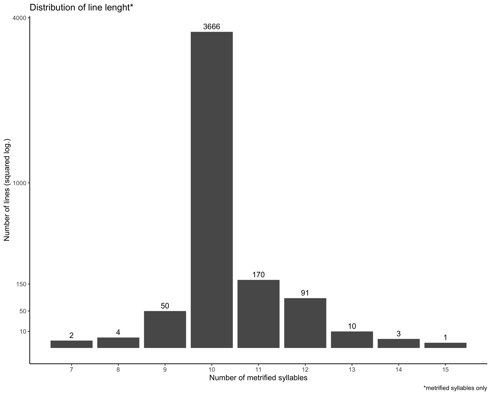

# The _Chanson de Roland_ : illformed lines
This document collects irregular lines in the _Chanson de Roland_, in the edition of the Base de Français Médiéval (`roland`[1]). Analysis is done with the PAM (Programme d'Analyse Métrique = Metrical Analysis Program [2]), a Python script that segment a given text into syllables, tag them with prosodic prominence and count the number of metrically-relevant syllables of each line to assess for their metrical wellformedness. Some ill-formed lines have been check in a more interventionnist edition, the one by Ian Short [3].
> [1] _Chanson de Roland_ (1972). Edited by Gérard Moignet, Paris: Bordas. Published on-line by the Base de français médiéval, http://catalog.bfm-corpus.org/roland. Version: 2014-02-24.<br>
> [2] POGGIO, Enzo & Timothée PREMAT (2019). "Le PAM, un Programme d'Analyse Métrique pour le français médiéval", in: _Actes des Rencontres lyonnaises des jeunes chercheurs en linguistique historique_, directed by Timothée Premat & Ariane Pinche, Lyon: Diachronies contemporaines, 2019, pp. 59-70. ⟨[hal-02320550](https://hal.archives-ouvertes.fr/hal-02320550)⟩ ⟨[10.5281/zenodo.3464477](https://zenodo.org/record/3464477#.X_SJdDRudqu)⟩<br>
> [3] _La Chanson de Roland_ (1990). Edited by Ian Short, Paris: Librairie Générale Française.

## Introduction | How to read this document

### What is this?
This document is made of notes that are published only for reproducibility of research and for data broadcasting. It does not necessarily follow strict scientific writing principles, and does not have the value of a publication.

### Warning about quality
I consider that I should not be blamed for any clumsy analysis contained is this document as **this is not a final analysis**. In my view, open science is more important than social pressure and fear to share non-completed stuff.

Open-science is not (only) about increasing your readership and 'quotability', but about spreading data and stuff. In order to move forward together, as a positive academic community, we need to be able to share non-perfect work (or, in this case, work that is half-way between data and analysis) and not be blamed for it.

### Quoting this document
If you use data and/or analysis proposed in this document, please quote it in a regular way. For now, I cannot guarantee that the GitHub repertory URL will stay fixed, so be aware that the URL you quote is not persistent. When my work will be advanced enough, I will consider using DOI for these documents.

>PREMAT, Timothée ([year of last update]). "The _Chanson de Roland_: illformed lines", ms. Version: [date of the last commit of the file]. Url: https://github.com/TimotheePremat/PhD/blob/main/Metrical%20Analysis/BFM/roland/roland.md

If you like this work and want to give me a real quotation (that counts for researchers metrics), you can quote one of the publication about the PAM (as [2] above, or more recent if available), as for instance, in full-text:

> This example came from unplublished work by PREMAT (YYYY), which collects illformed lines of the text with a prosodic tagging and metrical analysis software (POGGIO & PREMAT, 2019).<br><br>
>_Bibliography_<br>
>- POGGIO, Enzo & Timothée PREMAT (2019). "Le PAM, un Programme d'Analyse Métrique pour le français médiéval", in: _Actes des Rencontres lyonnaises des jeunes chercheurs en linguistique historique_, directed by Timothée Premat & Ariane Pinche, Lyon: Diachronies contemporaines, 2019, pp. 59-70. ⟨[hal-02320550](https://hal.archives-ouvertes.fr/hal-02320550)⟩ ⟨[10.5281/zenodo.3464477](https://zenodo.org/record/3464477#.X_SJdDRudqu)⟩<br>
>- PREMAT, Timothée (YYYY). "The _Chanson de Roland_: illformed lines", ms. Version: [date of the last commit of the file]. Url: https://github.com/TimotheePremat/PhD/blob/main/Metrical%20Analysis/BFM/roland/roland.md

### Norms
This document uses the following norms:
- each ill-formed line detected by the PAM is humanly read and annotated
- ill-formed lines are filtered by:
  - first, the type of analysis we provide (typology of the probable cause(s) of illformedness of the line)
  - then, the number of metrified syllables (m:_n_) detected by the PAM
- a line that can belong to several categories (because of incertainty of the analysis) or that does belong to several categories (because of several ill-formedness) is copied in its different typological categories
  - Only exception to that: all lines that are not in the 'Problems not related to schwas nor other weak vowels contraction' category could actually be in this category, as we can never be totally sure that an irregularity is due to phonological behaviour and not to _lapsus calami_ or other type of non-phonological source of illformedness.
- we refer to metrical breaks with the PAM conventions:
  - the position of the break is indicated by a number (the one the metrical position preceding it)
  - the type of break is indicated by the following:
    - `ma` for 'masculine' (oxytonic word before the break)
    - `épC` for 'epic break before a consonant-initial word'
    - `épV` for 'epic break before a vowel-initial word' (including _h_ when it does not prohibit elision[1])
    - `ly` for 'lyric' and 'ej' for 'enjambante'.
  - For instance, `4ma` means that the break is located after the fourth syllable, which is the tonic of an oxytonic word.
- line numbering:
  - the PAM produce its own line-numbering, which is not necessarily consistent with the original line-numbering encoded in the `xml` file. This is due to te fact that the source file can number missing lines, while the PAM only numbers line that have content it can analyse.
    - when only one line-numbering is given, it is the one of the PAM
    - when two line-numberings are given, the first one is the one of the PAM and the second one is the one of the original `xml` file.
    - differences between the two numberings are small (mostly from one to ten lines), so even with only one numbering system the reader should easily find his way through it.

> [1] For an _h_ not to prohibit elision, it has to be overwritten by an other character into the PAM input of into the PAM `config` files. The character we chose is an superscript _h_: ʰ, which is not one of the consonants recognized by the PAM. This way, the PAM does not treat _h_ in a specific way, it just has in analysis' input some words that begins with an _h_ (consonant: blocks elision) and some that begins with an _ʰ_ (non-consonant: triggers elision).

### _Non-corrected_ and _corrected_ version of the text
In the GitHub repertory, there are files that came from what we'll call the _non-corrected_ version of the text[1] and a folder that contains files that came from a _corrected_ version of the text. This document is mainly based on the non-corrected version of the text.
- lines that remain uncorrected in the corrected version are preceded by an un-checked box:
  - [ ] uncorrected line
- lines that have been corrected in the corrected version of the text are preceded by a checked box:
  - [x] corrected line (onyl in the `/corr` repertory)

The overview section below allows comparison between the two version. All the differences between these stats came from lines with checked boxes; all lines with checked boxes create a difference between these stats. Corrections are intended to allow for calculation about final schwas irregularity that would be hidden in implicit conventions about writing (for instance, one can consider that elision of non-schwa vowel in _ço est_ -> /sɛst/ is optional but regular and does not require the line to be considered ill-formed).

Correction obeys the following principles:
- we do not correct lines by adding or deleting textual content (words, affixes, etc.)
- for a line to be corrected, it should match all the following criteria:
  - correction needs to be applicable to other ill-formed line also (frequency of the pattern)
    - implies not to correct hapaxes[2]
  - it needs to be phonologically and semantically consistent
    - linguistic consistency of the pattern:
      - do not create illegal phonological sequences
      - do not create sequences that would have no meaning
      - as far as possible, avoid loosing morphosyntactic information by correcting the line
- when several correction are possible, one can be favoured based on:
  - frequency:
    - raw frequency:if one correction is more frequent than the other(s), prefer it.
    - phrase frequency: if the problem is located in a formulaic phrase or colon, check if other occurrences have the same problem and allow for one solution rather than for the other(s); if so, prefer the one that work for the most occurrences.
  - interventionism: if one correction implies less modification of the text in itself than the other(s), prefer it.
    - for instance, if a syllable is missing and the line contains a compound number, prefer adding _et_ between two of the members of the number than adding something else elsewhere in the line (cf. `Problems with numbers` section near the end of the document)
  - word status: prefer to correct a quite rare toponym or anthroponym rather than an usually steady common name.

> [1] _Non-corrected version of the text_: this version is the raw version obtained by deleting the `xml` formatting: it has suffered several modification, as replacement of abbreviated numbers (including manual gender agreement of _un~une_) and replacement of elision triggering _h_ by _ʰ_.<br>
> [2] Here, hapaxes mean that the order is not only not-attested in other texts but also not attested elswhere in the same text, of in too few occurrences are only in different phonological/metrical/prosodic/syntactic contexts.

## Overview
>In the tables and figures in this section, lines that are scanned by the pam as m:11 with 4épC and/or 6épC have been added to m:10.<br>
>This is not the case for line m>11, as the PAM cannot correctly assign the position of the break when there is more than 1 extra syllable.

### Before correction
|meter | count|  rate|
|:-----|-----:|-----:|
| m:7  	|   2  	| 0.05 	|
| m:8  	|   4  	| 0.10 	|
| m:9  	|  50  	|1.25 	|
| m:10 	| 3666 	| 91.72 	|
| m:11 	|  170 	| 5.00 	|
| m:12 	|  91  	| 2.28 	|
| m:13 	|  10  	| 0.25 	|
| m:14 	|   3  	| 0.08 	|
| m:15 	|   1  	| 0.03 	|
| _**Σ**_|_**3997**_|_**100**_|



### After correction
|meter | count|  rate|
|:-----|-----:|-----:|
|7     |     2|  0.05|
|8     |     4|  0.10|
|9     |    51|  1.28|
|10    |  3732| 93.37|
|11    |   131|  3.28|
|12    |    64|  1.60|
| _**Σ**_|_**3997**_|_**100**_|


## Problems in the edition
This section collects irregularities that are probably/maybe due to errors in the edition of the text and/or its XML formatting.

### Missing content without proper demarcation in the XML file.
- [ ] l. 1971: _un mort sur altre geter_
  - 3 syllables missing, no gap marked in the XML
- [ ] l. 2394: _E seint Michel del Peril_
  - 3 syllables missing, no gap marked in the XML
- [ ] l. 202: _De ses paiens enveiat quinze_
  - 2 syllables missing, no gap marked in the XML
- [ ] l. 1485: _Mielz est mult que jo l'alge ocire_
  - 2 syllables missing, no gap marked in the XML
- [ ] l. 2208: _Vos fustes filz al duc Reiner_
  - 2 syllables missing, no gap marked in the XML
- [ ] l. 2790: _Sire amiralz, dist Clarïens_:
  - 2 syllables missing, no gap marked in the XML
- [ ] l. 2968: _En quirs de cerf les seigneurs unt mis_:
  - 1 syllable missing, no gap marked in the XML
- [ ] l. 3983(3988): _Quant l' emperere ad fait sa justice_.
  - The final -e of _faite_ is missing; it should be _faite_
  - checked on the ms, which has _faite_
  - this line is not illformed, it just have been wrongly edited.

## Problems not related to schwas nor other weak vowels contraction
This section collects irregularities that are probably/maybe not due to mistakes in the file but to the reality of the line in the manuscript **and** that are not due to final schwas irregularities. It is organised by the number of metrically-relevant syllables assessed by the PAM.
> For instance, m:9[10] means that the concerned lines have 9 metrically-relevant syllables while they are supposed to have 10.


### m:9[10]
- [ ] l. 434: _Pris e liez serez par poësted_
  - _liez_, ppp de _lier_ : bisyllabique ici, mais pas au v. 96 (adj. <- LAETUS).
  - added a ¨ in roland.txt.
- [ ] l. 494: _Altrement ne m' amerat il mie . »_
  - 1 missing syllable
  - no explanation
- [ ] l. 632: _- Ben serat fait » , Guenes respundit ;_
  - 1 missing syllable
  - no explanation
- [ ] l. 727: _Guenes li quens l' ad sur lui saisie ;_
  - 1 missing syllable
  - no explanation
- [ ] l. 773: _Ne poet muer que des oilz ne plurt ._
  - 1 missing syllable
  - no explanation
- [ ] l. 1089: _Ne placet Damnedeu ne ses angles_
  - 1 missing syllable
  - no explanation
- [ ] l. 1463: _En tanz lius les avum nos portees !_
  - 1 missing syllable
  - no explanation
  - Short replaces _lieu_ by _terre_, but that's not conform to the ms. (fol 27r)
- [ ] l. 1619(1620): _Aprof li ad sa bronie desclose ,_ :
  - 1 missing syllable if <ni> = <gn> (lemma _broigne_). But would be OK if the syllabification is _bro.ni.e_... But most of the time, the word is 2-syllables long in roland.
- [ ] l. 1769(1771): _Ja estes veilz e fluriz e blancs ;_.
    - 1 missing syllable
    - no explanation
    - Short adds _vus_ in _Ja estes vus veilz_.
- [ ] l. 1834(1845): _N' i ad icel ne demeint irance_ :
  - 1 missing syllable
  - no explanation
  - Short edits a completely different line (_N' i ad icel durement ne s'en pleine_) which rime is less good.
- [ ] l. 2255(2257): _Ja la vostre anme nen ait sufraite !_
  - 2 missing syllables
  - no explanation ; probably faulty ms.
  - Short interpolates an entire phrase (_doel ne surfaite_)
- [ ] l. 2259(2261): _De ses pers priet Deu ques apelt ,_
  - 2 missing syllables
- [ ] l. 2269(2271): _Halt sunt li pui e mult halt les arbres ._
  - 1 missing syllable
  - Pbt _e mult halt sunt les arbres_ ?
- [ ] l. 2335(2337): _Deus ! perre , n' en laiser hunir France ! »_
  - 2 missing syllables
  - _Deus_ is abbreviated, Short develops _Damnedeux perre_ (fol. 42v)
- [ ] l. 2339(2341): _Cuntre ciel amunt est resortie ._
  - 1 missing syllable.
  - Short edits _le ciel_.
  - No explanation.
- [ ] l. 2391(2393): _Deus tramist sun angle Cherubin_
  - 1 missing syllable.
  - Short edits _li tramist_.
- [ ] l. 2470(2472): _Li altre en vunt cuntreval flotant ;_
  - 1 missing syllable.
  - Short edits _encuntreval_, but the ms. does have _cuntreval_.
  - No explanation.
- [ ] l. 1633(1635): _Par la noit la mer en est plus bele ,_
  - 1 missing syllable.
  - Short edits _Tute la noit_ but the ms. is unambiguous (fol. 48r)
- [ ] l. 2765(2767): _A l' amiraill en vunt esfreet ,_
  - 1 missing syllable.
  - Short edits _tut esfreet_.
- [ ] l. 2832(2334): _Mei ai perdut e tute ma gent . »_
  - 1 missing syllable.
  - Short edits _trestute_.
- [ ] l. 2843(2845): _Al matin , quant primes pert li albe ,_
  - 1 missing syllable.
  - Short edits _matinet_ but the ms. does have _matin_.
- [ ] l. 2966(2968): _En quirs de cerf les seignurs unt mis ;_
  - 1 missing syllable.
  - Short edits _les treis seignurs_, but the ms. does have _les seignurs_ (fol. 53v)
- [ ] l. 3001(3003): _Puis sunt muntez e unt grant scïence ._
  - 1 missing syllable.
  - Short edits _escience_. The ms. is not clear here (fol 54v).
  - Could it be a case of irregular gender agreement of _grand_? It is too early for GRANDIS to be agreed!
- [ ] l. 3206: _Cil respunt : « Sire , vostre mercit ! »_
  - 1 missing syllable.
  - Short edits _E cil respunt_, which better fit the metrical break.
- [ ] l. 3257: _E la disme est des barbez de Fronde :_
  - 1 missing syllable.
  - Short edits _Val-Fronde_.
- [ ] l. 3363: _« Ferez , baron , ne vos targez mie !_
  - 1 missing syllable.
  - Short edits _si ne vos_.
- [ ] l. 3372: _Veez mun filz , Carlun vait querant ,_
  - 1 missing syllable.
  - Short edits _qui Carlun_.
- [ ] l. 3500: _E aprés sin enbrunket sun vis ._
  - 1 missing syllable.
  - Short edits _E enaprés_.
- [ ] l. 3522: _Arguille si cume chen glatissent ;_
  - 1 or 2 missing syllable(s) + problem with the metrical break
  - Short edits _E cil d'Arguille_
- [ ] l. 3693: _Cume il est en sun paleis halçur ,_
  - 1 missing syllable.
  - Short edits _Si come il est_.

### m:11[10] not with 4épC or 6épC*
>\* Exclusion of 4épC and 6épC is due to the fact that the PAM cannot count the extrametrical syllable as being extrametrical. It is the user that must exclude the supernumerary syllable. Those lines are m:11[10] but they are ill-formed, because m:11[10] with 4épC or 6épC is actually m:10[10].

- [ ] l. 28: _Mandez Carlun , a l' orguillus e al fier ,_
  - Short edits _a l'orguillus al fier_ and he is probably right.
- [ ] l. 43: _Par num d' ocire i enveierai le men ._
- [ ] l. 408: _Envolupet fut d' un palie alexandrin :_
- [ ] l. 639: _Le grant aveir en presentez al rei Carles ,_
- [ ] l. 722: _Par tel aïr l' at estrussee e brandie_
  - contains a final schwa in the problematic colon, but is already elided so the problem is not with the final schwa.
- [ ] l. 742: _Kar me jugez ki ert en la rereguarde . »_
  - Or contraction of _ki ert_
  - Or line illformed because of the reduplication of the prefix of _rereguarde_
  - BUT _rereguarde_ is the regular form for _arrière garde_ (back of the armee).
  - That's why Short keep the double prefix and delete the determiner: _en rereguarde_.
- [ ] l. 761: _Quant ot Rollant qu' il ert en la rereguarde ,_
  - Idem, without the possibility of contraction. So probably inaccurate insertion of _la_ in the ms.
- [ ] l. 796: _E vint i Astors e Anseïs li veillz ,_
  - 1 extra syllable in the first colon.
- [ ] l. 907. _Si nus remeindrat Espaigne en quitedet . »_
  - 1 extra syllable in the first colon.
- [ ] l. 912: _« En Rencesvals guïerai ma cumpaigne ,_
  - _Cumpaigne_ is supposed to be a synonym of _compagnie_ (not a form of the word _compagnie_, but a different word, with same meaning). It is not the case in Roland, where on 10 _cumpaigne_, 6 are 4-syllables long
  - But in this line, it seems to be the case, as it requires the 3 syllables long form.
- [ ] l. 1087: _Nus i avum mult petite cumpaigne . »_
  - Idem.
- [ ] l. 1104: _Veeir poez , dolente est la rereguarde ;_
  - Idem l. 742 and 761.
- [ ] l. 1178: _De colps ferir , de receivre e de duner !_
- [ ] l. 1273: _Sansun li dux , il vait ferir l' almaçur ._
- [ ] l. 1588: _Ambure ocit , ki quel blasme ne quil lot ._
  - May be apocope in _blasme_
  - Or may just be ill-formed.
- [ ] l. 1734: _Einz le vespre mult ert gref la departie . »_
  - the problem seems to be in the second colon (in a 6ma configuration), so not related to final schwa issues.
- [ ] l. 1758: _« S' altre le desist , ja semblast grant mençunge ! »_
  - the problem is in the first colon (in a 4ma configuration). It could be due to:
    - an irregular form _desist_ for _dist_
    - an apocope on _le_, but this is by far less probable.
- [ ] l. 1804: _De ço qui calt ? car demuret i unt trop ._
  - cannot be due to a precocious case of deletion of final -t allowing for elision, because here it is a participle ("demeuré") which form a composed passed form with _unt_.
- [ ] l. 1879: _Einz deit monie estre en un de cez mustiers ,_
- [ ] l. 1953: _E flurs e cristaus en acraventet jus ;_
  - The problem is in the first colon, which do not contain final schwa.
- [ ] l. 2121: _Or ad li quens endreit sei asez que faire ._
  - Apocope in _que faire_? That would be weird. Can also just be ill-formed.
- [ ] l. 2208: _Pur hanste freindre e pur escuz peceier ,_
  - the problem is in the second colon
  - _peceier_ is supposed to be 3-syllables long (`lemma="peçoyer"`, 'to cut into pieces' (DMF))
- [ ] l. 2314: _« E ! Durendal , cum es bele e clere e blanche !_
  - the problem is the second colon and is not due to final schwa (all final schwas are elided there), nor to an inserted supernumerary _e_ ('et'), because that would cause one of the final schwas not to be elided.
- [ ] l. 2363: _Pur ses pecchez Deu en puroffrid lo guant ._
  - maybe the problem comes from a supernumerary prefixation of _puroffrid_ (prefixation can be unstable in Anglo-Norman)
- [ ] l. 2401: _U est l' arcevesque e li quens Oliver ?_
  - not only this line as one extra syllable, but also it has no well-formed break.
  - Remember that _arcevesque_ is often associated with an irregular apocope of final schwa; maybe it is after all a syncope of internal schwa? Cf. l. 170, 1124 and 1243.
- [ ] l. 2448: _Que li soleilz facet pur lui arester ,_
  - Maybe apocope on _facet_? Or just ill-formed.
- [ ] l. 2459: _El Val Tenebrus la les vunt ateignant ._
- [ ] l. 2513: _Des douze pers e de la franceise gent_
  - maybe apocope on _franceise_? Or just ill-formed.
- [ ] l. 2551: _Mais ço ne set liquels abat ne quels chiet ._
- [ ] l. 2567: _Carles se dort tresqu' al demain , al cler jur ._
- [ ] l. 2579: _Tencent a lui , laidement le despersunent :_
  - One can think of a syncope in _laidement_, or it can just be ill-formed. Here, it may not be due to a prefix problem, as _despersunent_ (put [sb] down) would make no sense without its prefix.
- [ ] l. 2710: _E Tervagan e Apollin , nostre sire ,_
  - The problem is in the first colon, in a 4ma configuration, so not a schwa problem.
- [ ] l. 2751: _Pui li dites il n' en irat , s' il me creit . »_
  - There can be multiple problems with this line:
    - Where to break the line?
      - If _dites_ is like Modern French _dites_ (/ˈditə/), this like cannot have a correct break.
      - If it is like _disez_ (something like /diˈtez/), the line is in a 4ma configuration
    - Extra syllable
      - There is definitely a non-schwa related problem in _il n'en irat s'il me creit_, which have one extra syllable.
- [ ] l. 2823: _Chet li as piez , li amiralz la reçut ;_
  - One extra syllable in the second colon.
- [ ] l. 2921: _Romain , Puillain e tuit icil de Palerne_
  - Probably _cil_ and not _icil_ (the determiner does not need to be reinforced there)
- [ ] l. 3032: _Les guïerat , kar la cumpaigne est fiere ._
  - Cf. l. 912 and 1087. Problem with the syllabification and/or the phonological representation of _compaigne_.
- [ ] l. 3173: _Ses filz Malpramis mult est chevalerus ;_
  - One extra syllable in the first colon.
- [ ] l. 3181: _« Bels filz Malpramis , ço li dist Baligant ,_
  - Idem. Probably a problem with _Malpramis_
- [ ] l. 3195: _« Bels filz Malpramis , ço li dist Baligant ,_
- [ ] l. 3238: _E la quarte est de Pinceneis e de Pers ,_
- [ ] l. 3242: _L' oidme est de Bruise e la noefme de Clavers ,_
  - Here, we have a strange situation:
  - _e la noefme ('ninth') de X_ is a formulary colon, where _X_ should be a one syllable word oxyton or a two syllables paroxyton. See:
    - [ ] l. 3226: _E l' oitme est de Nigres e la noefme de Gros_
  - But in the other two occurrences of this formulary colon, _X_ is a two syllables long oxyton, which induce an ill-formed line if _noefme_ /ˈnœfmə/: there on extra syllable. Maybe apocope on _noefme_ is OK?
    - The other line is l. 3256: _L' oidme est d' Argoilles e la noefme de Clarbone ,_, with a 4épC.
  - The problem is probably not related to schwa: _e la noefme ('ninth') de X_ is a formulary colon, where _X_ is a one syllable word oxyton or a two syllables paroxyton. It should not be a two syllables oxyton, as here.
- [ ] l. 3321: _Baligant ad ses cumpaignes trespassees ._
  - This is not a case of problem with the syllabification and/or the phonological representation of _compaigne_ (Cf. lines 912, 1087 and 3032)
- [ ] l. 3323: _« Venez , paien , kar jon irai en l' estree . »_
- [ ] l. 3357: _E Guineman justet a un rei leutice ._
  - This line cannot be correctly breaked. And it has one extra non-schwa syllable.
- [ ] l. 3390: _Unc einz ne puis ne fut si fort ajustee ;_
- [ ] l. 3405: _Ben le conuis que gueredun vos en dei_
- [ ] l. 3452: _Morz est li gluz ki en destreit vus teneit ;_
  - Two solutions:
    - contraction in _ki en_
    - or line just ill-formed.
- [ ] l. 3487: _E Tervagan e Mahumet altresi :_
- [ ] l. 3554: _Trestut seit fel ki n' i fierget a espleit ! »_
- [ ] l. 3563: _Si se vunt ferir , granz colps s' entredunerent_
  - This line cannot be breaked correctly.
  - And it has one extra syllable.
- [ ] l. 3617: _Prent Tencendur , muntet i est li reis magnes ._
  - This is not a case of precocious deletin of final consonant, as _muntet_ is participle.
- [ ] l. 3636: _A halte voiz s' escrie : « Aiez nos , Mahum !_
- [ ] l. 3658: _A mailz de fer e a cuignees qu' il tindrent_
- [ ] l. 3676: _Mais n' ad talent que li facet se bien nun ._
  - This is probably not related to final schwa irregularity, because there is just one extra word...
- [ ] l. 3753: _Rollant me forfist en or e en aveir_
  - Maybe deletion of the prefix in _forfist_? But semantically needed.
- [ ] l. 3800: _N' en i ad celoi nel graant e otreit ,_
- [ ] l. 3806: _Vivre le laisez , car mult est gentilz hoem ._
  - It is highly improbable that that line would induce apocope in _vivre_ given the /vr/ cluster...
- [ ] l. 3822: _Que que Rollant a Guenelun forsfesist ,_
  - could be due to syncope in _forsfesist_
  - or to deletion of the prefix (still semantically needed)
- [ ] l. 3880: _Pinabels est forz e isnels e legers ._
- [ ] l. 3938: _Munter l' unt fait en une mule d' Arabe ;_
  - Probably _une mule arabe_. But note that the AND have _arabe_ for `lemma=Arabie`.
- [ ] l. 3987: _Culcez s' est li reis en sa cambre voltice ._

### m:12[10]
- [ ] l. 569: _Lessez la folie , tenez vos al saveir ._
  - With 4épC, there's one extra syllable in the first colon.
- [ ] l. 599: _N' asemblereit jamais Carles si grant esforz ;_
  - There no possibility to do an epic break there; maybe apocope in _Carles_ but still one extra syllable.
- [ ] l. 608: _La traïsun jurat e si s' en est forsfait ._
- [ ] l. 646: _E vingt hostages , des plus gentilz desuz cel . »_
  - One extra syllable in the last colon
  - (4épC)
- [ ] l. 994: _Paien s' adubent des osbercs sarazineis ,_
  - One extra syllable (probably in _sarazineis_)
  - (4épC)
- [ ] l. 1014: _Que malvaise cançun de nus chantet ne seit !_
  - Can't tell if it is just an ill-formed line or a line with two irregular schwas.
- [ ] l. 1278: _Trenchet li le coer , le firie e le pulmun ,_
  - There's probably not only to much syllables but too much words.
- [ ] l. 1359: _La hanste briset e esclicet josqu' as poinz ._
  - There is one extra syllable in the final colon
  - (4épC)
- [ ] l. 1363: _U est vostre espee , ki Halteclere ad num ?_
  - One extra non schwa syllable in the first colon
  - (4épC)
- [ ] l. 1368: _Que ses cumpainz Rollant li ad tant demandee ,_
  - Maybe contraction in _li ad_, but still one extra syllable. May just be ill-formed.
- [ ] l. 1436: _Ço est li granz dulors por la mort de Rollant ._
  - Contraction in _ço est_
  - Still one extra syllable. Probably _deul_ instead of _dulors_.
- [ ] l. 1437: _Franceis i unt ferut de coer e de vigur ;_
  - There's simply two extra syllables there. Following one other m:12 line!
- [ ] l. 1495: _Beste nen est nule ki encontre lui alge ._
  - One extra syllable, probably in the first colon (in order to allow for a 4épC)
  - But it can also be elsewhere if one applies contraction in _ki encontre_ (?)
- [ ] l. 1691: _« Bel sire , chers cumpainz , pur Deu , que vos en haitet ?_
  - Should not be analyzed as a schwa-specific irregularity because:
    - even though there is a IPh boundary after _sire_, apocope or extrametricality of _-e_ in _sire_ would made the line impossible to break.
    - Therefore, it is just an ill-formed line with no plausible explanation.
  - [ ] l. 1765: _Naimes li duc l' oïd , si l' escultent li Franc ._
    - Apocope on _deivent_ (third plural person) (cf. l. 1765)
    - still one extra syllable in the second colon
- [ ] l. 1958: _Ne a muiler ne a dame qu' aies veüd_
  - Multiple transformations can be applied on this line:
    - One can think of contracting _ne a_, but it cannot be done on both _ne a_ because that would made the line impossible to break.
    - One can think of contracting the hiatus in _veüd_, but it seems to be the canonical form (participle of _voir_, 'see') and the laisse is assonated in /u/.
    - At the end of the day, there is no obvious way of 'correcting' this line which may just be ill-formed.
- [ ] l. 1960: _Vaillant a un dener que m' i aies tolut ,_
  - One can think of contracting _aies_ in one syllable, but that would create a 5-syllables colon, which does not exist in Roland. It would require to also consider the same colon as being ill-formed, so this correction have no avantage over directly considering it ill-formed for no phonological reasons.
- [ ] l. 2100: _Rumput est li temples , por ço que il cornat ._
  - Contraction in _que il_ is not a good solution, as it would create a 5 syllables colon.
  - There is probably one extra syllable in the first colon, which deletion would allow for 4épC and make the line wellformed.
- [ ] l. 2142: _Dist l' arcevesque : « Fel seit ki ben n' i ferrat !_
  - There's one extra non schwa syllable in the second colon
  - (4épC)
- [ ] l. 2154: _Espiez e lances e museraz enpennez ;_
  - One extra syllable in the last colon
  - (4épC)
- [ ] l. 2329: _Jo l' en cunquis e Escoce e Vales Islonde_
  - Maybe an apocope in _Vales_, but there is still one extra syllable in the second colon.
- [ ] l. 2433: _Lessez gesir les morz tut issi cun il sunt ,_
- [ ] l. 2446: _Sur l' erbe verte descent li reis en un pred ,_
  - One non-schwa extra syllable in the last colon
  - (4épC)
- [ ] l. 2465: _Il n' en i ad barge ne drodmund ne caland ._
  - Probably one extra non-schwa syllable in the first colon, which would authorize for 4épC.
- [ ] l. 2483: _Tolez lur les seles , lé freins qu' il unt es chefs ,_
  - Probably one extra non-schwa syllable in the first colon, which would authorize for 4épC.  
- [ ] l. 2550: _E prenent sei a braz ambesdous por loiter ;_
  - Two extra non final schwa syllables in the second colon.
- [ ] l. 2553: _Aprés icele li vien un' altre avisiun ,_
  - Problem with the syllabification of _avisiun_ ('mental representation, thought, etc.' in DMF, lemma `avision`):
    - it has dieresis in lines 725 and 836
    - But seems to be in syneresis here. No other examples in Roland.
  - (4épC)
- [ ] l. 2584: _Par les mains le pendent desur une culumbe ,_
  - There's one extra syllable in the first colon
  - (4épC)
- [ ] l. 2617: _E tuz ses ydeles quë il soelt adorer ,_
  - There's one extra syllable in the first colon
  - Weirdly enough, our edition and Short's (l. 2619) have _que il_, corresponding to non abreviated _que il_ in the ms. (47v). What's remarkable here is that Short haven't corrected the first colon, but it is probable that it is indeed the first colon that is illformed, and that the second is a correct 6-syllables colon with _que il_.
- [ ] l. 2678: _E a mei venget pur reconoistre sun feu ._
  - Maybe apocope on _reconoistre_, or just ill-formed (prefix?)
  - (4épC)
- [ ] l. 2696: _Dit cascun a l' altre : « Caitifs , que devendrum ?_
  - Maybe confusion _cascun ~ chaque_?
  - (4épC)
- [ ] l. 2697: _Sur nus est venue male confusïun :_
  - One extra syllable in the first colon.
  - Like the previous line!
- [ ] l. 2699: _Li quens Rollant li trenchat ier le destre poign ;_
  - One extra syllable in the last colon
  - Apocope on _le_ is not plausible
- [ ] l. 2721: _E ! lasse , que nen ai un hume ki m' ociet ! »_
  - Final schwa apocope is not probable here: both apocope should be located in the same colon, and non shows conditions for expectable schwa apocope.
- [ ] l. 2722: _Dist Clarïen : « Dame , ne parlez mie itant !_
  - One extra syllable in the last colon.
  - (6épC)
- [ ] l. 3182: _Li altrer fut ocis le bon vassal Rollant_
  - Contraction in _li altrer_
  - Still one extra syllable: apocope on _altrer_? Or just ill-formed.
- [ ] l. 3226: _E l' oitme est de Nigres e la noefme de Gros ,_
  - See l. 3242.
  - Probably _E_ is supernumerary in the first colon.
- [ ] l. 3256: _L' oidme est d' Argoilles e la noefme de Clarbone ,_
  - See l. 3242.
- [ ] l. 3543: _Si vait ferir celui ki le dragun teneit ,_
  - Probably _cil-celui_ alternation
  - Still one extra syllable. Maybe contraction _ki le_ -> _kil_?
    - To be checked.
- [ ] l. 3544: _Qu' Ambure cravente en la place devant sei_
  - Misterious first colon. The XML says: `<note resp="#cmn" type="internal"> Qu'Ambure cravente (Nom propre ou numéral 'tous deux, le dragon etl'enseigne' ?) Un Amborre est cité v. 3297, voir note de Moignet) </note>`
- [ ] l. 3618: _Paien s' en turnent , ne volt Deus qu' il i remainent ._
    - Maybe a problem with the /i/ sequence in _qu'il i_?
    - Or a internal schwa deletion in _remainent_
    - Or just an illformed line...
- [ ] l. 3646: _Or set il ben que elle n' est mais defendue ._
  - Non written contraction in _que elle_
  - Still one extra syllable.
- [ ] l. 3704: _Ço dist al rei : « O est Rollant le catanie ,_
  - Two extra syllables in the second colon.
  - (_catanie_ is `lemma="capitaine"`)
- [ ] l. 3722: _Desur les espalles ad la teste clinee ._
  - Probably a _desur-sur_ alternation
  - in this case, 4épC.
- [ ] l. 3764: _Seignors , jo fui en l' ost avoec l' empereür ,_
  - Two extra syllables, in the first or the second colon.
- [ ] l. 3785: _U l' emperere les noz dous cors en asemble ,_
  - One extra syllable in the last colon.
  - (4épC)
- [ ] l. 3969: _Hom ki traïst altre , nen est dreiz qu' il s' en vant ._

### m:13[10]
- [ ] l. 400: _L' emperere meïsmes ad tut a sun talent ;_
  - Probable apocope or syncope on _emperere_
  - Still on extra syllable in the first colon to provoke 4épC.
    - Note that _meïsme(s)_ with dieresis is the regular form.
- [ ] l. 401: _Cunquerrat li les teres d' ici qu' en Orient . »_
  - Line probably just illformed:
    - The extract in passed time, so _cunquerrat_ should not have syncope.
- [ ] l. 686: _De Marcilie s' en fuient por la chrestïentet_
- [ ] l. 1494: _Petites les oreilles , la teste tute falve ;_
- [ ] l. 1687: _Ne mes seisante , que Deus i ad esparniez ;_
- [ ] l. 2133: _Ne orguillos , ne malvais hume de male part ,_
  - even with two apocopes, the last colon ad one extra syllable...
- [ ] l. 2184: _Iloec truvat Gerin e Gerer sun cumpaignun ,_
- [ ] l. 2822: _A itel hunte , sire , mon seignor ai perdut ! »_
  - Very probably due to interpollation of _sire_
- [ ] l. 3703: _As li Alde venue , une bele damisele ;_
  - One extra no schwa syllable in the first colon.
    - Apocope on _alde_ is not plausible, given the /ldv/ cluster it would create.
  - Apocope on _une_ or _bele_ in the second colon?

## Problems possibly related to final schwas
This section collects irregularities that are probably/maybe not due to mistakes in the file but to the reality of the line in the manuscript **and** that are probably due to final schwas irregularities.

### m:9[10]
- [ ] l. 390: _Kar chascun jur de mort s'abandunet_
  - 1 syllable missing
  - _abandunet_ is paroxytonique: in feminine assonance and non metrified in the other occurrence in this text (l. 1535)
- [ ] l. 685: _Ki l' en conduistrent tresqu' en la mer :_
  - 1 missing syllable.
  - Probably _tresquë_, to be checked.
- [ ] l. 714: _En un bruill par sum les puis remestrent ._.
  - _Brile_ is attested once in the AND, but the regular form is monosyllabic like in _roland_.
  - The XML file indicates: ```<!-- erreur de saisie : pas de duplication dans l'édition -->```
  - Short edits _Enz en un breul_
    - Therefor, we can suppose that the correction of the XML is faulty by deleting a word. Or, as often, that Short adds a function word when he misses a syllable...
- [ ] l. 730: _D' enz de sale uns veltres avalat ,_
  - The 1 missing syllable cannot be due to an irregular support of final schwa in _sale_ because it would cause a lyric break, unknown in _roland_.
- [ ] l. 1158: _Les renges li batent josqu' as mains ._
  - maybe _jusques aux_? (the ms. has _josqu'_ (fol. 21v))
- [ ] l. 1265: _L' osberc li rumpt entresque a la charn_
  - It seems that _entresque_ can resist elision ; it has been corrected <entresquë> in `special_syll` (PAM instruction file).
- [ ] l. 1323: _A quinze cols l' ad fraite e perdue ;_
  - It seems like there can be an Intonation Phrase (IPh) boundary after _fraite_; in Meigret we see that the only position where final schwas can resist elision in an unpredictable fashion is before conjunctions like _et_ which allow for a IPh boundary by restructuration.
- [ ] l. 1398(1399): _Tant' hanste i ad e fraite e sanglente ,_
  - Idem?
  - Short edits _frettë_!
  - Or it might be that _fraite_ is an irregular participle?
- [ ] l. 2016(2018): _Sun cumpaignun Rollant sur tuz humes ._
  - Short edits _trestuz_, but the ms. does only have _tuz_ (fol. 36v)
- [ ] l. 2038(2040): _Repairez est des muntaignes jus ;_
  - Short edits _de ces muntaignes_, but the ms. does only have _des_.
- [ ] l. 2059(2061): _Guardez , seignurs , qu' il n' en algent vif ._
  - In the ms., the page is damaged, the writing goes around the scar but is poorly legible.
  - Short edits _qu'il ne s'en algent vif_. (fol. 37v)
- [ ] l. 2064(2066): _Li quens Rollant fut noble guerrer ,_
  - Short edits _gerreier_,but the ms. does have _guerrer_ (fol. 37v)
- [ ] l. 2209(2211): _Pur orgoillos veintre e esmaier_
  - IPh boundary before _e_?
  - Short edits _e veintre e esmailler_, but there is no '&' in the ms before _veintre_ (fol. 40r)
- [ ] l. 2211(2214): _E pur glutun veintre e esmaier ,_
  - - IPh boundary before _e_? (idem supra)
- [ ] l. 2275(2277): _Met sei en piez e de curre s' astet ._
  - Short edits _se hastet_ (which is grammaticaly correct), but the ms. does have <sastet> (fol. 41v).
- [ ] l. 2552(2557): _Li emperere n' est mie esveillét ._
  - Short edits _ne s'est_, but it can also be _mië esveillet_.
- [ ] l. 2576(2578): _Ensembl' od li plus de vingt mil humes ,_
  - Short edits _trente mil_!
  - More probably _vingt et mil_
    - In this case, the line is well-formed. It has been corrected in the input file of the PAM.
    - Note <ensemblod> in the ms: very beautiful and must be analysed!
- [ ] l. 2926(2928): _E ! France , cum remeines deserte !_
  - Probably _cum-cume_
  - It is not _deserté_, as the assonance is feminine.
- [ ] l. 2939(2941): _Entre les lur aluee e mise_
  - Short edits _fust alüee_
  - Could also be _alueë e mise_ to avoid an /ee/ hiatus...
  - To be checked: if there are other cases of that.
- [ ] l. 3391: _Josqu' a la nuit n' en ert fins otriee ._
  - Short edits _otrïee_, but _otrie_ is supposed to be /trj/ monosyllabic in Old French.
  - Maybe _jusques_ ?

### m:11[10] not with 4épC or 6épC*
>\* Exclusion of 4épC and 6épC is due to the fact that the PAM cannot count the extrametrical syllable as being extrametrical. It is the user that must exclude the supernumerary syllable. Those lines are m:11[10] but they are ill-formed, because m:11[10] with 4épC or 6épC is actually m:10[10].

- [ ] l. 21: _Si me guarisez e de mort e de hunte ! »_
  - Short edits _m'gurarisez_ !
- [ ] l. 27: _E dist al rei : « Ore ne vus esmaiez !_
  - _ore_ can be subject to some variation.
  - Short edits _ore_
- [ ] l. 37: _Vos le sivrez a la feste seint Michel ,_
- [ ] l. 77: _Dient paien : « De ço avun nus asez ! »_
  - maybe the _nus_ is interpolated?
  - Short have a completely different version: _Bien dist nostre avoëz_
- [ ] l. 81: _Si me direz a Carlemagne le rei_
- [ ] l. 83: _Ja einz ne verrat passer cest premer meis_
  - The problem is in the first colon.
- [ ] l. 138: _Baisset sun chef , si cumencet a penser ._
  - Probably a precocious case of _-t_ falling in _cumencet_, allowing for the elision of the posttonic.
- [ ] l. 141: _Sa custume est qu' il parolet a leisir ._
  - Idem.
- [ ] l. 156: _Charles respunt : « Uncore purrat guarir . »_
  - _Encore_ is subject to final schwa variation.
- [ ] l. 170: _Le duc Oger e l' arcevesque Turpin ,_
  - Apocope on _arcevesque_?
  - Rhythmical factors?
- [x] l. 180: _« Seignurs barons , dist li emperere Carles ,_
  - Two possibilities:
    - [ ] apocope on _emperere_
    - [x] contraction of the /i/ of _li_ in hiatus
      - that would be in post-verbal position of the subject.
- [x] l. 197: _Set anz ad pleins que en Espaigne venimes ;_
  - _que en_ is a weird graphical form for _qu'en_
  - elision in clitics is not always written?
- [x] l. 369: _Par grant saveir parolet li uns a l' altre ._
  - Two solutions:
    - [ ] precocious case of _-t_ falling in _parolet_
      - short, with a different word-roder (?), edits _parole_ with no _-t_ and elision (_parole a l'altre_)
    - [x] contraction in _li uns_
- [ ] l. 416: _E dist al rei : « Salvez seiez de Mahum_
  - Probably just ill-formed without schwa problem, but still contains a schwa.
- [ ] l. 458: _Ne por tut l' aveir ki seit en cest païs ,_
  - Probably just ill-formed without schwa problem, but still contains a schwa.
- [ ] l. 509: _E Guenes l' ad pris par la main destre as deiz ,_
  - Or it is just an illformed line, or it is a case of final schwa irregularity in an anthroponym.
- [ ] l. 517: _Einz demain noit en iert bele l' amendise . »_
  - Or it is just an illformed line
  - Or it is a problem in elision of the final schwa of _bele_.
    - Short have mooved the words to solve it: _bele en iert l'amendise_.
- [ ] l. 639: _Eles valent mielz que tut l' aveir de Rume ._
  - The problem is in the first colon.
  - There is probably an irregular apocope in _eles_ or _valent_!
- [x] l. 740: _« Seignurs barons , dist li emperere Carles ,_
  - [ ] Apocope in _emperere Carles_, in a formulary phrase?
  - [x] Or contraction in _li emperere_
- [ ] l. 765: _Cume fist a tei le bastun devant Carle ? »_
  - _Cume_ is subject to variation.
- [x] l. 837: _Que entre mes puinz me depeçout ma hanste ;_
  - Non-written elision in _que en_
- [ ] l. 851: _quatre cent milie en ajustet en trois jurz ;_
  - precocious case of _-t_ falling in _parolet_
  - which allows for elision and wellformed line.
- [ ] l. 856: _La tere Certaine e les vals e les munz :_
  - Irregular apocope in _terre certaine_?
- [ ] l. 872: _Ja n' avrez mais guere en tut vostre vivant . »_
  - Irregular apocope on _vostre_?
- [ ] l. 931: _De l' altre part est Escremiz de Valterne ;_
- [ ] l. 959: _Quant ele le veit , ne poet muer ne riet ;_
- [ ] l. 959: _De l' altre part est Chernubles de Munigre ._
- [ ] l. 978: _Que quatre mulez ne funt , quant il sumeient ._
  - _mulez_ tagged `lemma="mulet"`, but if it is _mule_, that would be a possible 4épC and the line would be wellformed.
- [ ] l. 1092: _Pur ben ferir l' emperere plus nos aimet . »_
  - irregular apocope on _emperere_.
    - This word seems to have a lot of apocopated occurrences. Or not, because elision of the determiner is more probable.
- [x] l. 1124: _D' altre part est li arcevesques Turpin ._
  - [ ] irregular apocope on _arcevesque_?
    - cf. l. 170
  - [x] Or just contraction elision of the determiner in _li arcevesques_... (not the case l. 170 though)
- [ ] l. 1217: _Entre les dous oilz mult out large le front ,_
  - Can be due to apocope on _entre_ or on _large_ (the latter for correct break)
- [x] l. 1224: _Ot le Oliver , sin ad mult grant irur ._
  - Non written elision in _le Oliver_
- [x] l. 1243: _Ben l' entendit li arcevesques Turpin :_
  - [ ] irregular apocope on _arcevesque_?
    - cf. l. 170 and 1124
  - [x] or elision of the determiner
- [ ] l. 1257: _Nuveles vos di : mort vos estoet susfrir ._
  - can be due to apocope on _nuveles_
  - can just be ill-formed (maybe _vos_ is additional)
- [ ] l. 1424: _Pluies e gresilz desmesureement ;_
  - Apocope of _pluies_? Or the line is just ill-formed.
- [x] l. 1473: _Issi est neirs cume peiz ki est demise ;_
  - [x] contraction in _ki est_
  - [ ] or _cum-cume_ alternation.
- [ ] l. 1499: _Pierres i ad , ametistes e topazes ,_
  - apocope in _ametistes_?
- [x] l. 1534: _Plus est isnels que esprever ne arunde ._
  - non written elision in _que esprever_
- [ ] l. 1544: _Li quens Rollant en apelet Oliver :_
  - Probably a precocious case of _-t_ falling in _apelet_, allowing for the elision of the posttonic.
- [ ] l. 1588: _Ambure ocit , ki quel blasme ne quil lot ._
  - Maybe apocope in _blasme_
  - Or may just be ill-formed.
- [x] l. 1699: _Mielz voeill murir que hunte nus seit retraite . »_
  - non-written elision in _que hunte_
  - but before a (non phonological?) <h> in _hunte_.
    - To be checked: the status of <h> in _hunte_
- [ ] l. 1758: _« S' altre le desist , ja semblast grant mençunge ! »_
  - the problem is in the first colon (in a 4ma configuration). It could be due to:
    - an irregular form _desist_ for _dist_
    - an apocope on _le_, but this is by far less probable.
- [ ] l. 1806: _Cuntre le soleil reluisent cil adub ,_
  - Apocope in _cuntre_ of _le_? (Something like: _contre el soleil_?)
- [x] l. 1846: _Si est blecet , ne quit que anme i remaigne ._
  - non written elision in _que anme_
- [x] l. 1865: _De doel murra , se altre ne m' i ocit ._
  - [x] non written elision in _se altre_
  - [ ] or 6épC?
- [ ] l. 1884: _Home ki ço set que ja n' avrat prisun_
  - Apocope on _home_?
  - Actually, _home_ is subject, and subject-case is supposed to be _hom_! So, here, it would be that the wrong form have been written (_home_ instead of _hom_) but the right form is the one needed by the metrics.
- [ ] l. 1892: _Que mort l' abat seinz altre descunfisun ._
  - apocope on _descunfisun_?
    - cannot be a 6épC as _altre_ is adj. of _descunfisun_.
- [ ] l. 2121: _Or ad li quens endreit sei asez que faire ._
  - Apocope in _que faire_? That would be weird. Can also just be ill-formed.
- [x] l. 2134: _Ne chevaler , se il ne fust bon vassal ._
  - non written contraction in _se il_
- [ ] l. 2158: _Mais Veillantif unt en trente lius nafret_
  - Apocope on _trente_? (Written _.XXX._)
- [ ] l. 2200: _Encuntre sun piz estreit l' ad embracet ;_
  - Apocope on _encuntre_?
- [x] l. 2228: _Einz que om alast un sul arpent de camp ,_
  - Non written elision in _que om_
- [x] l. 2285: _Tient l' olifan , que unkes perdre ne volt ,_
  - Non written elision in _que unkes_
- [ ] l. 2448: _Que li soleilz facet pur lui arester ,_
  - Maybe apocope on _facet_? Or just ill-formed.
- [ ] l. 2513: _Des douze pers e de la franceise gent_
  - maybe apocope on _franceise_? Or just ill-formed.
- [ ] l. 2525: _L' empereür li cumandet a guarder ._
  - Probably a precocious case of _-t_ falling in _cumencet_, allowing for the elision of the posttonic.
- [ ] l. 2579: _Tencent a lui , laidement le despersunent :_
  - One can think of a syncope in _laidement_, or it can just be ill-formed. Here, it may not be due to a prefix problem, as _despersunent_ (put [sb] down) would make no sense without its prefix.
  - Can also be due to apocope/non-metrification of _-ent_ in _tencent_, with a 6ma.
- [x] l. 2665: _Que il n' alt ad Ais , o Carles soelt plaider ._
  - Non written contraction in _que il_
- [ ] l. 2670: _Ki messages soleit faire volenters ._
  - apocope on _faire_?
- [ ] l. 2692: _Asez i ad de cele gent paienur ,_
  - apocope on _cele_?
  - Should not be an 6épC as break should not fall between a determiner and its name.
    - The PAM didn't analyzed it as a 6épC, by the way.
    - Could also be just ill-formed.
- [ ] l. 2719: _Trestute Espaigne avrat Carles en baillie ._
  - Apocope on _Carles_?
- [ ] l. 2839: _Muntet el ceval , vient a sa gent puignant ._
  - Probably a precocious case of _-t_ falling in _muntet_, allowing for the elision of the posttonic.
- [ ] l. 2842: _« Venez , paien , car ja s' en fuient ferant ! »_
  - Precocious apocope (or non-metricification, at least) of _-ent_ in _fuient_?
- [ ] l. 2961: _E Oliver e l' arcevesque Turpin ._
  - Apocope (or internal contraction) in _arcevesque_.
  - Cf. l. l. 170, 1124, 1243 and 2401.
- [ ] l. 3009: _Si Arrabiz de venir ne se repentent ,_
  - One of the final schwas in _ne se_ should be apocopated.
- [ ] l. 3108: _Cum ad oret , si se drecet en estant ,_
  - Probably a precocious case of _-t_ falling in _decet_, allowing for the elision of the posttonic.
- [x] l. 3119: _Mult gentement li emperere chevalchet ._
  - Two solutions:
    - [ ] apocope on _emperere_
    - [x] contraction in _li emperere_
- [ ] l. 3218: _E l' altre aprés de Micenes as chefs gros ;_
  - Apocope on _Micenes_?
- [ ] l. 3330: _Ne més que tant cume l' emperere en ad ,_
  - Impossible to know if it an apocope on _emperere_ (cf. passim) or a _cum-cume_ variation.
- [x] l. 3514: _Ço que estre en deit , ne l' alez demurant . »_
  - non written elision in _que estre_
- [x] l. 3593: _Chrestïentet , e puis te amerai sempres ;_
  - non written elision in _te amerai_
- [ ] l. 3607: _Quant Carles oït la seinte voiz de l' angle ,_
  - apocope in _Carles_?
  - or deletion of final _-s_ and then regular elision?
- [ ] l. 3654: _Clers est la lune e les esteiles flambient ._
  - There is an extra syllable and a lot of final schwas, but which is to be apocopated?
  - Note the magnificent _clers est_ with no -e for the fém. while CLARUS, -A, -UM should agree in gender.
- [ ] l. 3702: _Muntet el palais , est venut en la sale ._
  - Probably a precocious case of _-t_ falling in _muntet_, allowing for the elision of the posttonic.
- [ ] l. 3740: _Halz est li jurz , mult par est grande la feste ,_
  - Very interesting:
  - _grande_ should not be agreed in gender, as GRANDIS cannot produce _grande_; morphological refection happens later, at the end of the middle ages.
  - The expected _grand_ would produce a regular line
  - So... Can we say there was _grand_ before the copy, and the copist added a precocious _-e_ feminine morpheme and the line became ill-formed?
- [ ] l. 3745: _« Seignors barons , dist Carlemagnes li reis ,_
  - Probably apocope on _Carlemagnes_; note that there is a syntactic and prosodic break here.
- [ ] l. 3826: _Pur ço le juz jo a pendre e a murir_
  - MAGNFICENT: post-verbal _jo_ is atonic and can fall into the extrametrical position of epic break !!!
- [ ] l. 3844: _Fait cels guarder tresque li dreiz en serat ._
  - Apocope in _tresque_? That would be rare and weird, and reduce _tresque_ to _tres_ (the non reinforced form).
- [ ] l. 3904: _Mielz voeill murir que il me seit reprovet . »_
  - Non written elision in _que il_
- [ ] l. 3973: _« En ma maisun ad une caitive franche ._
  - Maybe just ill-formed, if not, apocope on _une_ or _caitive_.

### m:12[10]
- [ ] l. 179: _Des ore cumencet le cunseill que mal prist ._
  - probably _or-ore_ alternation; the most common form is _or_ (adverbe, DMF `lemma="or2"`)
  - (4épC)
- [x] l. 303: _Quant ço veit Guenes que ore s' en rit Rollant ,_
  - [ ] probably _or-ore_ alternation; the most common form is _or_ (adverbe, DMF `lemma="or2"`)
    - cf. l. 176
  - [x] or non written elision in _que ore_
  - (4épC)
- [ ] l. 359: _Mielz est que sul moerge que tant bon chevaler ._
  - _moerge_ = _meurs-je_ ('that I die')
  - as l. 3826, but here postverbal _je/jou_ does not fall into the extrametrical position of the epic break.
  - So... there are two extra syllables.
  - Apocope on _-ge_ in _moerge_?
- [ ] l. 365: _Entret en sa veie , si s' est achiminez ._
  - Precocious deletion of final _-t_ in _entret_, which allows for elision.
  - (4épC)
- [x] l. 383: _Er matin sedeit li emperere suz l' umbre ,_
  - [ ] There is one non-schwa problem in the first colon
  - [x] The second colon can be repared by contraction or elision in _li emperere_
- [ ] l. 460: _Que Charles li mandet , li reis poësteïfs :_
  - Apocope on _Charles_
  - (4épC)
- [x] l. 613: _Se en rereguarde troevet le cors Rollant ,_
  - Non written elision in _se en_
  - (4épC)
- [ ] l. 783: _Li empereres apelet ses niés Rollant :_
  - Two solutions:
    - [x] Contraction in _li empereres_
    - [ ] Apocope in _empereres_ or _apelet_
  - (4épC or 6épC)
- [ ] l. 946: _E cil respundent : « A vostre comandement !_
  - Two solutions:
    - Syncope in _comandement_
    - Or apocope on _vostre_
  - (4épC)
- [ ] l. 1014: _Que malvaise cançun de nus chantet ne seit !_
  - Can't tell if it is just an ill-formed line or a line with two irregular schwas.
- [ ] l. 1138: _Par penitence les cumandet a ferir ._
  - Precocious deletion of final _-t_ in _cumandet_, which allows for elision.
  - (4épC)
- [ ] l. 1403: _Karles li magnes en pluret , si se demente ._
  - One final schwa should be apocopated, on _Karles_, _magnes_ or _pluret_?
  - In a 4épC or 6épC configuration.
- [ ] l. 1647: _De l' oree sele lé dous alves d' argent_
  - Probably irregular apocope on _oree_ ('golden, made of gold' (DMF `oré1`)), which allows for a 4épC
- [ ] l. 1743: _Ja cil d' Espaigne ne s' en deivent turner liez ._
  - Apocope on _deivent_ (third plural person)
  - 4épC
- [ ] l. 1765: _Naimes li duc l' oïd , si l' escultent li Franc ._
  - Apocope on _deivent_ (third plural person) (cf. l. 1765)
  - still one extra syllable in the second colon
  - or it is the first colon that has two extra syllables.
- [x] l. 1796: _D' osbercs e de helmes e d' espees a or ._
  - Elision of _de_ before _helmes_?
  - That would authorize an 4épC and made the line wellformed.
- [ ] l. 2329: _Jo l' en cunquis e Escoce e Vales Islonde_
  - Maybe an apocope in _Vales_, but there is still one extra syllable in the second colon.
- [x] l. 2437: _Josque Deus voeille que en cest camp revengum . »_
  - Non-written elision in _que en_
  - (4épC)
- [ ] l. 2447: _Culchet sei a tere , si priet Damnedeu_
  - Apocope on _culchet_?
  - (4épC)
- [ ] l. 2478: _Culchet sei a tere , sin ad Deu graciet ._
  - Apocope on _culchet_?
  - (4épC)
  - same first colon as previous quoted line!
- [ ] l. 2520: _N' i ad cheval ki puisset ester en estant :_
  - Probably confusion _ester_ (<- STARE) ~ _estre_, which would allow for elision and wellformedness.
  - (6épC, no need to search for precocious _-t_ deletion in _puisset_)
- [x] l. 2666: _Si hume li lodent , si li unt cunseillet ._
  - [ ] Apocope on _hume_? The expected form is _hume_ (accusative singular), and _hom_ (nominative singular) would be a mistake of declention. Still, it would correct the line...
  - [x] Or contraction in _si hume_
  - (4épC)
- [ ] l. 2678: _E a mei venget pur reconoistre sun feu ._
  - Maybe apocope on _reconoistre_, or just ill-formed (prefix?)
  - (4épC)
- [x] l. 2688: _Tant chevalcherent que en Sarraguce sunt ._
  - Non written elision in _que en_
  - (4épC)
- [ ] l. 2883: _Guardet a la tere , veit sun nevold gesir ._
  - precocious deletion of final _-t_ in _gardet_, which allows for elision.
  - (4épC)
- [ ] l. 3543: _Si vait ferir celui ki le dragun teneit ,_
  - Probably _cil-celui_ alternation
  - Still one extra syllable. Maybe contraction _ki le_ -> _kil_?
    - To be checked.
- [x] l. 3646: _Or set il ben que elle n' est mais defendue ._
  - [x] Non written contraction in _que elle_
  - [ ] Still one extra syllable. _elle_ -> _el_?
- [ ] l. 3675: _E Bramidonie , qu' il meinet en sa prisun ;_
  - precocious deletion of final _-t_ in _meinet_, which allows for elision.
  - (4épC)
- [ ] l. 3742: _Dés ore cumencet le plait e les noveles_
  - Probably _or-ore_ alternation. Not the first time!
  - (4épC)
- [x] l. 3829: _Se or ad parent ki m' en voeille desmentir ,_
  - [x] Non written elision in _se or_
  - [ ] apocope on _voeille_?
- [ ] l. 3876: _Les alves turnent , les seles cheent a tere ._
  - can be irregular apocope on _turnent_ (if 6épC) or _seles_ (if 4épC), but more probably:
  - non metrification of _-ent_ in _cheent_ (= _choient_, "(they) fall").

### m:13[10]
- [ ] l. 400: _L' emperere meïsmes ad tut a sun talent ;_
  - Probable apocope or syncope on _emperere_
  - Still on extra syllable in the first colon to provoke 4épC.
    - Note that _meïsme(s)_ with dieresis is the regular form.
- [ ] l. 1496: _Li arcevesque brochet , par tant grant vasselage !_
  - Contraction in _li arcevesque_
  - Syncope/apocope (often needed) in _arcevesque_
  - (4épC)
- [ ] l. 3703: _As li Alde venue , une bele damisele ;_
  - One extra no schwa syllable in the first colon.
    - Apocope on _alde_ is not plausible, given the /ldv/ cluster it would create.
  - Apocope on _une_ or _bele_ in the second colon?

## Cases of no-schwa vowel elided

### m:9[10]
- [ ] l. 1388(1390): _Seint Gabriel de sa main l' ad pris ._ Short édite _li ad_. Le ms. a bien <lad> (fol. 43v)

### m:11[10] not with 4épC or 6épC*
>\* Exclusion of 4épC and 6épC is due to the fact that the PAM cannot count the extrametrical syllable as being extrametrical. It is the user that must exclude the supernumerary syllable. Those lines are m:11[10] but they are well-formed, because m:11[10] with 4épC or 6épC is actually m:10[10].

- [x] l. 180: _« Seignurs barons , dist li emperere Carles ,_
  - Two possibilities:
    - [ ] apocope on _emperere_
    - [x] contraction of the /i/ of _li_ in hiatus
      - that would be in post-verbal position of the subject.
- [x] l. 252: _Seignurs baruns , qui i purruns enveier ,_
  - [x] _qui i_ contracted in _qui_ or _qu'i_?
    - this is the solution we choose, to preserve the text.
  - [ ] Short has just _qui_; _i_ is semantically and syntactically redondant (_enveier al sarrazin_)
- [x] l. 254: _Respunt Rollant : « Jo i puis aler mult ben !_
  - contraction of _jo i_?
- [x] l. 274: _« Francs chevalers , dist li emperere Carles ,_
  - contraction of _li emperere_
  - that would be in post-verbal position of the subject.
- [x] l. 314: _Ço est Baldewin , ço dit , ki ert prozdoem ._
  - Two solutions:
    - [x] Contraction of _ço est_
    - [ ] _Baldewin_ is a weird graphical form for _Balduin_, bi-syllabic.
- [ ] l. 324: _Ne Oliver , por ço qu' il est si cumpainz ._
  - Contraction in _qu'il est_?
  - Short edits _qu'est_
- [x] l. 329: _- Jo i puis aler , mais n' i avrai guarant_
  - Contraction in _jo i_
- [x] l. 351: _En la cort al rei mult i avez ested ,_
  - [ ] Contraction in _en la_?
  - [ ] Short edits _en cort_
  - [x] Maybe _enl cort_ would be more correct?
- [x] l. 382: _Ne més Rollant , ki uncore en avrat hunte ._
  - Contraction in _ki uncore_
- [x] l. 447: _Ja nel dirat de France li emperere_
  - Contraction in _li emperere_
- [x] l. 498: _Livrez le mei , jo en ferai la justice . »_
  - Contraction in _jo en_
- [x] l. 504: _E Jurfaret , ki est ses filz e ses heirs ,_
  - Contraction in _ki est_
  - Short edits _k'est_
- [x] l. 720: _Entre ses poinz teneit sa hanste fraisnine ;_
  - Irregular apocope in _hanste_? Not that irregular if the <h> has no phonological representation...
- [x] l. 740: _« Seignurs barons , dist li emperere Carles ,_
  - [ ] Apocope in _emperere Carles_, in a formulary phrase?
  - [x] Or contraction in _li emperere_
- [ ] l. 742: _Kar me jugez ki ert en la rereguarde . »_
    - Or contraction of _ki ert_
    - Or line illformed because of the reduplication of the prefix of _rereguarde_
    - BUT _rereguarde_ is the regular form for _arrière garde_ (back of the armee).
    - That's why Short keep the double prefix and delete the determiner: _en rereguarde_.
    - Cf. infra.
- [ ] l. 761: _Quant ot Rollant qu' il ert en la rereguarde ,_
    - Idem, without the possibility of contraction. So probably inaccurate insertion of _la_ in the ms.
- [x] l. 786: _Retenez les , ço est vostre salvement ! »_
  - Contraction in _ço est_
- [x] l. 866: _Dunez m' un feu , ço est le colp de Rollant ;_
  - Contraction in _ço est_
- [ ] l. 1104: _Veeir poez , dolente est la rereguarde ;_
  - Idem l. 742 and 761.
- [x] l. 1124: _D' altre part est li arcevesques Turpin ._
  - [ ] irregular apocope on _arcevesque_?
    - cf. l. 170
  - [x] Or just contraction elision of the determiner in _li arcevesques_... (not the case l. 170 though)
- [x] l. 1243: _Ben l' entendit li arcevesques Turpin :_
  - [ ] irregular apocope on _arcevesque_?
    - cf. l. 170 and 1124
  - [x] or elision of the determiner
- [x] l. 1276: _L' escut li freinst , ki est ad or e a flurs ,_
  - Contraction in _ki est_
- [x] l. 1433: _Dient plusor : « Ço est li definement ,_
  - contraction in _ço est_
- [x] l. 1473: _Issi est neirs cume peiz ki est demise ;_
  - [x] contraction in _ki est_
    - arbitrary choosen
  - [ ] or _cum-cume_ alternation.
- [x] l. 1488: _Ço ert uns reis qu' il ocist en Denemarche ._
  - contraction in _ço ert_ (in this case, 6ma)
- [x] l. 1504: _Enprés sun colp ne quid que un dener vaillet ,_
  - contraction in _que un_
- [x] l. 1527: _Ço est Climborins , ki pas ne fut produme ._
  - contraction in _ço est_
- [ ] l. 1999: _Ja est ço Rollant , ki tant vos soelt amer !_
  - Contraction in _ja est_?
  - Or line just ill-formed...
- [x] l. 2106: _Jo oi al corner que guaires ne vivrat ._
  - Contraction in _jo oi_
- [x] l. 2566: _Li angles Deu ço ad mustret al barun ._
  - contraction in _ço ad_
- [x] l. 2613: _Ço est l' amiraill , le viel d' antiquitet ,_
  - Contraction in _ço est_
- [x] l. 2739: _« Laissez ço ester ! » dist Marsilies li reis ._
  - Contraction in _ço ester_?
- [x] l. 2757: _Jo ai cunté n' i ad mais que sept liwees ._
  - Contraction in _jo ai_
  - Should not be due to a problem with _liwees_ ('lieues'), as the graphic form _-ees_ can only symbolise a /ˈe.əs/ phonological représentation. Should be a dialectal normal form. Therefore, this is a 6ma line, breaked after _mais_.
- [x] l. 2903: _Se jo ai parenz , n' en i ad nul si proz . »_
  - Contraction in _jo ai_
- [x] l. 3119: _Mult gentement li emperere chevalchet ._
  - Two solutions:
    - [ ] apocope on _emperere_
    - [x] contraction in _li emperere_
- [x] l. 3228: _Ço est une gent ki unches ben ne volt ._
  - Contraction on _ço est_
- [x] l. 3244: _Ço est une gent ki Damnedeu ne sert ;_
  - Contraction in _ço est_
- [x] l. 3258: _Ço est une gent ki Deu nen amat unkes ._
  - Contraction in _ço est_
  - Cf. l. 3244: it is clearly formulaic.
- [x] l. 3309: _Ço est Canabeus , li reis de Floredee :_
  - Contraction in _ço est_
- [x] l. 3452: _Morz est li gluz ki en destreit vus teneit ;_
  - Two solutions:
    - [x] contraction in _ki en_
    - [ ] or line just ill-formed.
- [x] l. 3778: _Ço est Pinabel , del castel de Sorence ;_
  - Contraction in _ço est_
- [x] l. 3954: _Ki hume traïst sei ocit e altroi ._
  - Contraction in _ki hume_

### m:12[10]
- [x] l. 6: _Fors Sarraguce , ki est en une muntaigne ._
  - Contraction on _ki est_
  - (4épC)
- [x] l. 246: _Respunt dux Neimes : « Jo irai , par vostre dun !_
  - Contraction on _jo irai_
  - (4épC)
- [x] l. 383: _Er matin sedeit li emperere suz l' umbre ,_
  - [ ] There is one non-schwa problem in the first colon
  - [ ] The second colon can be repared by contraction or elision in _li emperere_
- [x] l. 459: _Que jo ne li die , se tant ai de leisir ,_
  - Contraction of _jo ne_ in _jon_ (l. 3323)
  - (4épC)
- [ ] l. 464: _Getet le a tere , sil receit Blancandrin ;_
  - Apocope (and fall of final _-t_, but not sufficient by itself) in _Getet_?
  - or contraction in _le a_?
  - (4épC)
- [x] l. 490: _Ço est de Basan e de sun frere Basilie_
  - [x]Contraction in _ço est_
  - [ ]**and** apocope in _frere Basilie_, where there is lax syntactic and prosodic connexion (a comma could be inserted there, meaning there could be a prosodic break)
- [x] l. 502: _Ses meillors humes en meinet ensembl' od sei ,_
  - precocious deletion of final _-t_ in _meinet_, which allows for elision.
  - (4épC)
- [x] l. 783: _Li empereres apelet ses niés Rollant :_
  - Two solutions:
    - [x] Contraction in _li empereres_
    - [ ] Apocope in _empereres_ or _apelet_
  - (4épC or 6épC)
- [x] l. 1234: _Munjoie escriet , ço est l' enseigne Carlun ._
  - Contraction in _ço est_
  - (4épC)
- [ ] l. 1368: _Que ses cumpainz Rollant li ad tant demandee ,_
  - Maybe contraction in _li ad_, but still one extra syllable. May just be ill-formed.
- [x] l. 1436: _Ço est li granz dulors por la mort de Rollant ._
  - [x] Contraction in _ço est_
  - [ ] Still one extra syllable. Probably _deul_ instead of _dulors_.
- [x] l. 1495: _Beste nen est nule ki encontre lui alge ._
  - [ ] One extra syllable, probably in the first colon (in order to allow for a 4épC)
  - [x] But it can also be elsewhere if one applies contraction in _ki encontre_ (?)
- [x] l. 1832: _Li empereres chevalchet ireement_
  - Contraction on _li empereres_
  - Which allows for 6épC and made the line wellformed
- [x] l. 2236: _Ço est l' arcevesque , que Deus mist en sun num ._
  - Contraction in _ço est_
  - 4épC
- [x] l. 2352: _E li empereres en est e ber e riches . »_
  - Contraction of _li empereres_
  - 4épC
- [x] l. 2666: _Si hume li lodent , si li unt cunseillet ._
  - [ ] Apocope on _hume_? The expected form is _hume_ (accusative singular), and _hom_ (nominative singular) would be a mistake of declention. Still, it would correct the line...
  - [x] Or contraction in _si hume_
  - (4épC)
- [x] l. 2768: _U est Marsilie que jo aveie mandét ? »_
  - Non written elision in _jo aveie_
  - (4épC)
- [x] l. 3182: _Li altrer fut ocis le bon vassal Rollant_
  - [x] Contraction in _li altrer_
  - [ ] Still one extra syllable: apocope on _altrer_? Or just ill-formed.
- [x] l. 3208: _Ço est de la tere ki fut al rei Flurit :_
  - Contraction in _ço est_
  - (4épC)
- [ ] l. 3618: _Paien s' en turnent , ne volt Deus qu' il i remainent ._
  - Maybe a problem with the /i/ sequence in _qu'il i_?
  - Or a internal schwa deletion in _remainent_
  - Or just an illformed line...
- [x] l. 3841: _Dist li empereres : « Bons pleges en demant . »_
  - Contraction of _li emprereres_
  - (4épC)
- [x] l. 3881: _Li uns requiert l' altre , n' unt mie des destrers ._
  - Contraction in _li uns_
  - (4épC)
- [x] l. 1496: _Li arcevesque brochet , par tant grant vasselage !_
  - [x] Contraction in _li arcevesque_
  - [ ] Syncope/apocope (often needed) in _arcevesque_
  - (4épC)
- [x] l. 2404: _Ive e Ivorie , que jo aveie tant chers ?_
  - contraction in _jo aveie_
  - (4épC)
- [x] l. 3970: _Quant li empereres ad faite sa venjance ,_
  - contraction in _li empereres_
  - (4épC)

## Cases of medial schwas not to analyse (in my PhD) but still to keep:

### m:9[10]
- [ ] l. 300: _Einz i frai un poi de legerie_
  - _frai_ is clearly a wrong (from the metrical perspective) syncopated form of _ferai_

### m:11[10]
- [x] l. 314: _Ço est Baldewin , ço dit , ki ert prozdoem ._
  - Two solutions:
    - [x] Contraction of _ço est_
    - [ ] _Baldewin _ is a weird graphical form for _Balduin_, bi-syllabic.
- [ ] l. 1638: _Enceis nel vit , sil recunut veirement_
  - may be due to _vraiment-vairement_ alternation? But at this early stage of Old French, internal schwa in _vairement_ is supposed to be solid.
  - may just be ill-formed.
- [ ] l. 2012: _Durement en halt si recleimet sa culpe ,_
  - Syncope in _durement_?
- [ ] l. 2401: _U est l' arcevesque e li quens Oliver ?_
  - not only this line as one extra syllable, but also it has no well-formed break.
  - Remember that _arcevesque_ is often associated with an irregular apocope of final schwa; maybe it is after all a syncope of internal schwa? Cf. l. 170, 1124 and 1243.
- [ ] l. 2579: _Tencent a lui , laidement le despersunent :_
  - One can think of a syncope in _laidement_, or it can just be ill-formed. Here, it may not be due to a prefix problem, as _despersunent_ (put [sb] down) would make no sense without its prefix.
  - Can also be due to apocope/non-metrification of _-ent_ in _tencent_, with a 6ma.
- [ ] l. 3822: _Que que Rollant a Guenelun forsfesist ,_
  - could be due to syncope in _forsfesist_
  - or to deletion of the prefix (still semantically needed)

### m:12[10]
- [ ] l. 573: _En dulce France s' en repairerat li reis ;_
  - Syncope in _repairerat_?
  - (4épC)
- [ ] l. 946: _E cil respundent : « A vostre comandement !_
  - Two solutions:
    - Syncope in _comandement_
    - Or apocope on _vostre_
  - (4épC)
- [ ] l. 3618: _Paien s' en turnent , ne volt Deus qu' il i remainent ._
  - Maybe a problem with the /i/ sequence in _qu'il i_?
  - Or a internal schwa deletion in _remainent_
  - Or just an illformed line...

### m:13[10]
- [x] l. 1496: _Li arcevesque brochet , par tant grant vasselage !_
  - [x] Contraction in _li arcevesque_
  - [ ] Syncope/apocope (often needed) in _arcevesque_
  - (4épC)

## Problems with numbers
There are often problems with numbers that are noted in latin style (e.g. .C. for _cent_) in the text. There have been re-writen in modern form (e.g. .C. -> _cent_) before the PAM has been applied, but composed numbers can take a _et_ between their members and there is apparently no rule to predict it. Also, numbers can generate other errors:
- [ ] l. 2158: _Mais Veillantif unt en trente lius nafret_
  - Apocope on _trente_? (Written _.XXX._)

### m:9[10]
- [ ] l. 1041: _Cil devant sunt .C. milie ad escuz ,_ : it is expected than elision apply in _milie ad_ -> /milad/. Probably the number must be read _cent et milie_, as it often happen in old and middle French. Modified as such in roland.txt.
- others are modified without being reported here.

### m:12[10]
- [ ] l. 548: _Funt les enguardes a vingt milie chevalers ._
  - _mil_ and not _milie_ (not caused by the PAM, it is written in the XML)
  - (4épC)

## Other remarks

### Lines > m:13[10]
>Because it is higly improbable that lines with more than 13 metrified syllables can be corrected with final schwa irregularity, these lines are not analysed.

#### m:14
- [ ] l. 1847: _Deus ! quels seisante humes i ad en sa cumpaigne !_
- [ ] l. 2290: _Aprés li dit : « Culvert paien , cum fus unkes si os_
- [ ] l. 3659: _Fruissent les ymagenes e trestutes les ydeles :_

#### m:15
- [ ] l. 2073: _E wigres e darz e museras e agiez e gieser ._

### Anthroponyms
- _Marsiliun_ is problematic:
  - 4 syllables long and oxytonic at lines 222, 414, 618, 880, 1214 (=880 bis), 1562, 1903
  - 3 syllables long and/or paroxytonic at lines 276, 288
  - treated as 4-syllables long and oxytonic in the PAM
  - ! other graphies exist!
    - _marsilie_ have same problem, treated as 3-syllables long paroxytonic by the PAM
- [ ] l. 509: _E Guenes l' ad pris par la main destre as deiz ,_
  - Or it is just a illformed line, or it is a case of final schwa irregularity in an anthroponym.

### Subj.
- _diet_ est bien bisyllabique paroxyton (l. 424, 531 (c.ép.), 2360 (id.))
  - Subj.Pré.3sg _dire_

### Adj/ppp/CONJ
- _repairet_ peut être _repéré_ ou _repère_ (Ind.Pré.3sg). Édité _repairét_ sur le seul vers problématique dans roland.txt (1867).
- _pasmet_ peut être _pâmé_ ou _pâme_ (Ind.Pré.3sg). Édité _pasmét_ aux vers problématiques dans roland.txt (l. 1987, 2218). Cf. l. 1986-1987 pour les deux formes !
- _regardet_ : idem.
- _desmailet_ : :idem.
- _culchet_ : idem.
- _enveiet_ : idem.
- _esveiet_ : idem.
- _demuret_ : idem.
- _venget_ : idem.
- _turnet_ : idem.

### Ind.Pré/Subj.Pré.
- _esvertuet_ édité en _esvertüet_ l. 2296.

### Latinism
- [x] l. 3265: _E un' ymagene Apolin le felun ._
  - Here, _ymagene_ is a latin graphic form for French _image_, which should have two posttonic syllables but only one. This is, of course, a 4épC in which fall the two posttonic syllables, so this line is not ill-formed, independently of the number of posttonic syllables.
  - implemented as _ymagn'_ in `roland_corr.txt`.
- [x] l. 3685: _E Oliver , sun nobilie cumpaignun ,_
  - Here, _nobilie_ can be a latin graphic form for _noble_; that would produce a well-formed line.
  - implemented as _nobil'_ in `roland_corr.txt`.
- [x] l. 3772: _Carles l' oïd e si nobilie baron ._
  - Here, _nobilie_ can be a latin graphic form for _noble_; that would produce a well-formed line.
  - Or it can be an ill-formed line...
  - implemented as _nobil'_ in `roland_corr.txt`.

#TODO
- [x] Lines with less than 9 syllables
- [x] Lines m:9
- [ ] Check breaks in m:10?
- [x] Lines m:11 without 4épC and 6épC
  - [ ] Check breaks in m:11 with 4épC and 6épC?
- [x] Lines m:12
- [x] Lines with more than 12 syllables
- [ ] Add general stats
- [ ] Produce test to evaluate the influence of final schwa on the probability for a line to be ill-formed.
